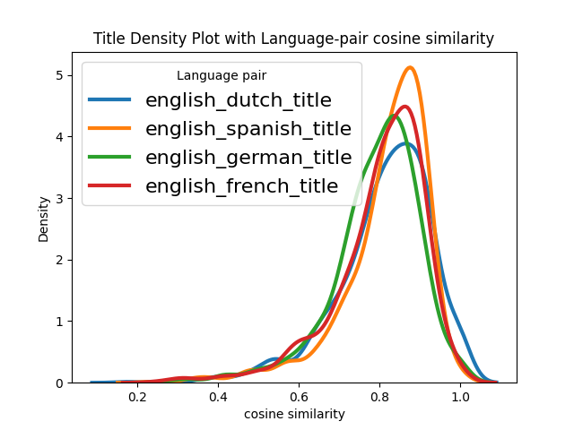
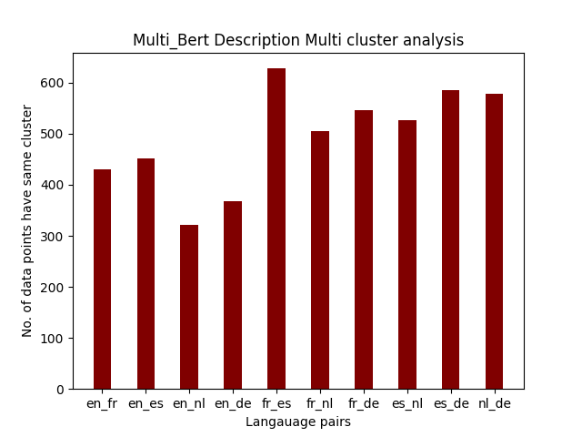
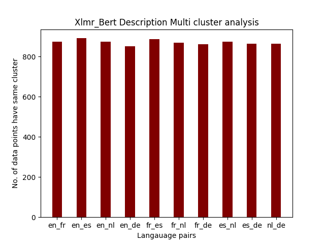

<h1 align="center">Multi-lingual Embedding Efficiency on ONET Data </h1>
<h3 align="center">Harsha Renkila</h3>

## ℹ️ Overview
Representation of Text in the N-Dimensional space is key for many NlP tasks such as NER, Sentiment analysis, Classisication, Language Modelling, etc.. has gain vital importance in the recent days. These representation of text as embeddings which captures the semantic meaning of the text. Most of the embeddings are training on the english corpus and showed capability of achieving NLP tasks.  When it comes to other languages there are different models for each language which can do the tasks. But, in realtime if a product support multiple languages let say 100, deploying 100 different language models for all languages will not highly resource taking and highly expensive. Due to that there are some Multilingual language models like Multilingual Bert, Multilingual Distill Bert, Multilingual Universal Sentence Encoders, Multilingual XLMR Bert, etc.. are supporting the more than 100 different languages with single model. These word embedding models are trained and evaluated with text with general context like wikipedia, books, etc..  using cosine-similarity. When it comes to domain-specific data, we want to evaluate the model without pre-training, how it performs across different languages on the same task.

## Languages Considered for Experiment
    - English (language Code - EN)
    - Spanish (language Code - ES)
    - German (language Code - DE)
    - French (language Code - FR)
    - Dutch (language Code - NL)
## Dataset
### O*net
The ONET Program is the nation's primary source of occupational information. Valid data are essential to understanding the rapidly changing nature of work and how it impacts the workforce and U.S. economy. From this information, applications are developed to facilitate the development and maintenance of a skilled workforce.
It has detailed descriptions of the world of work for use by job seekers, workforce development and HR professionals, students, developers, researchers, and more!

Out of wide variety of Onet data. We have choosen Jobzone data for our classification experiments.

#### Job Zone
A Job Zone is a group of occupations that are similar in:

how much education people need to do the work,
how much related experience people need to do the work, and
how much on-the-job training people need to do the work.
The five Job Zones are:

- Job Zone 1 external site - occupations that need little or no preparation
- Job Zone 2 external site - occupations that need some preparation
- Job Zone 3 external site - occupations that need medium preparation
- Job Zone 4 external site - occupations that need considerable preparation
- Job Zone 5 external site - occupations that need extensive preparation

[Sample data can be viewed from this link](https://www.onetonline.org/find/zone?z=0)

#### Occupation  Data

The Occupation data is having the occupation title and duties description of the corresponding occupation.

Structure and Description of data as follows:

 |     Column     |          Type           |    Column Content     |
|:--------------:|:-----------------------:|:---------------------:|
 | O*NET-SOC Code |     	Character(10)      |    O*NET-SOC Code     |
|     Title	     | Character Varying(150)	 |    O*NET-SOC Title    |
|  Description   | Character Varying(1000) | O*NET-SOC Description |

Entire Occupations are categorised into 23 major groups called Domains
- Domains are as follows:
  - Management Occupations
  - Business and Financial Operations Occupations
  - Computer and Mathematical Occupations
  - Architecture and Engineering Occupations
  - Life, Physical, and Social Science Occupations
  - Community and Social Service Occupations
  - Legal Occupations
  - Educational Instruction and Library Occupations
  - Arts, Design, Entertainment, Sports, and Media Occupations
  - Healthcare Practitioners and Technical Occupations
  - Healthcare Support Occupations
  - Protective Service Occupations
  - Food Preparation and Serving Related Occupations
  - Building and Grounds Cleaning and Maintenance Occupations
  - Personal Care and Service Occupations
  - Sales and Related Occupations
  - Office and Administrative Support Occupations
  - Farming, Fishing, and Forestry Occupations
  - Construction and Extraction Occupations
  - Installation, Maintenance, and Repair Occupations
  - Production Occupations
  - Transportation and Material Moving Occupations

Totally there are **923** Occupations with the domain data is considered and preprocessed.

Preprocessed data and code can be found in the directory:

    --- Project
        |--- Data
               |--- Processed_data.csv
        |--- src
              |--- data_preprocessing.py

Due to imbalance in Job Zone data the data is up sampled and the counts for each class is as follows:

 
  | Job Zone | Counts |
|:--------:|:------:|
  |    2     |  289   |
  |    4     |  224   |
  |    3     |  220   |
  |    5     |  158   |
  |    1     |   32   |

The data imbalancing code implementation can be found in below path: 

    --- Project
        |--- src
              |--- data_balancing.py

## PreTrained Language Embeddings

There are different attention based multi-language models are present out of that 5 models are chosen for experiment

### Multilingual Bert

BERT is a method of pre-training language representations, meaning that we train a general-purpose "language understanding" model on a large text corpus (like Wikipedia), and then use that model for downstream NLP tasks that we care about (like question answering). BERT outperforms previous methods because it is the first unsupervised, deeply bidirectional system for pre-training NLP.

Unsupervised means that BERT was trained using only a plain text corpus, which is important because an enormous amount of plain text data is publicly available on the web in many languages.

Bert has basic building blocks of [transformer blocks](https://arxiv.org/pdf/1706.03762.pdf) used in encoder and decoder architecture.

 
  

For tokenization, using a 110k shared WordPiece vocabulary. The word counts are weighted the same way as the data, so low-resource languages are upweighted by some factor. 
Because Chinese (and Japanese Kanji and Korean Hanja) does not have whitespace characters, added spaces around every character in the CJK Unicode range before applying WordPiece. This means that Chinese is effectively character-tokenized. 

For all other languages, apply the same recipe as English: (a) lower casing+accent removal, (b) punctuation splitting, (c) whitespace tokenization. We understand that accent markers have substantial meaning in some languages, but felt that the benefits of reducing the effective vocabulary make up for this.

Multilingual Bert will support 108 languages trained from MNLI dataset, wikipedia, language translation data etc.. 
**MBert model consists of 12-layer, 768-hidden, 12-heads, 177M parameters**

### Distill Multilingual BERT

  Distill Multilingual model is similar to the Bert model with fewer layers and trained as the supervised model. The model has 6 layers, 768 dimension and 12 heads, totalizing 134M parameters (compared to 177M parameters for mBERT-base)

### Multilingual Universal Sentence Encoder 
  
  Multilingual Universal sentence Encoder comes up with the two models as follows: 

#### Transformer model
  The transformer based sentence encoding model
constructs sentence embeddings using the encoding sub-graph of the transformer architecture
(Vaswani et al., 2017). This sub-graph uses attention to compute context aware representations
of words in a sentence that take into account both
the ordering and identity of all the other words.
The context aware word representations are converted to a fixed length sentence encoding vector
by computing the element-wise sum of the representations at each word position.3 The encoder
takes as input a lowercased PTB tokenized string
and outputs a 512 dimensional vector as the sentence embedding.

#### Deep Averaging Network (DAN)
Deep averaging network (DAN) (Iyyer et al.,2015) whereby input embeddings for words and
bi-grams are first averaged together and then
passed through a feedforward deep neural network
(DNN) to produce sentence embeddings. Similar to the Transformer encoder, the DAN encoder
takes as input a lowercased PTB tokenized string
and outputs a 512 dimensional sentence embedding.

The output of Transformer and DAN model is taken as embeddings which can be used as word embeddings for next subsequent tasks. It only supports 15 languages as of now.

### XLMR BERT
Sentence-BERT(SBERT), a modification of the BERT network using siamese and triplet networks that is able to
derive semantically meaningful sentence embeddings. However, the limitation of SBERT is that it only supports English at the moment while leave blank for other languages. To solve that, we can use the model architecture similar with Siamese and Triplet network structures to extend SBERT to new language.

The idea is simple, first we produces sentence embeddings in English sentence by SBERT, call it as Teacher model. Then create new model for our desired language, we call Student model, and this model tries to mimic the Teacher model. In other word, the original English sentence will be trained in Student model in order to get the vector same as one in Teacher model.

As the example below, both “Hello World” and “Hallo Welt” were put through Student model, and the model tries to generate two vectors that are similar with the one from Teacher model. After training, the Student model are expected to have ability for encoding the sentence in both language English and the desired language.

 
  

For XLMR BERT model student model is Xlmr-Roberta model and Bert model as Teacher Model. The language pair data is feeded to this network. It can support 108 languages.

### FastText

Write the content

## Experiments

  The Goal of this project  is to evaluate the performance/similarity of multilingual embedding models on job zone data(Onet Occupation-job zone)

### Visualizing the embeddings in Lower Dimensional Space
   Assuming that  multilingual language models will have semantically equivalent words/sentences of all the languages will be closer in the higher dimensional space. So to check this we are getting the embeddings for description and title from all the languages and visualizing in the 2-d space.
  
   Below is the directory where you can find the plots.

     --- Project
        |--- output
              |--- word_visualization_plots
                      |--- M_USE_words_viz.png
                      |--- *

  
 
  

    The above chart is for Multilingual bert low dimensional representation. When we see into the chart the same titles in  different languages are not close enough.

After observing all the plots for some title the points for all languages are very near but most of them are scattered.

    The Usage of visualizing words

    from project.utils.plotting import visualize_word_vectors, get_sample_index
    index =  get_sample_index()
    visualize_word_vectors("Multi_Bert","title",index)

### Cosine Similarity analysis

  This analysis to see how the different languages are in par with english language embeddings. For this we have taken the english language embeddings of title, description, domain and other language embeddings and performed cosine similarity for each language pair and plotted the distribution for each model.

    The usage of cosine sim analysis:
    from project.src.multilingual_analysis import MultilingualAnalysis

    path = "/Users/harsharenkila/PycharmProjects/ANLP/project/embeddings/M_USE_{}_data.csv"
    kk = MultilingualAnalysis(path)
    kk.vectorspace_analysis("english","title")
    kk.vectorspace_analysis("english","description")
    kk.vectorspace_analysis("english","domain")
    
Below is the directory where you can find the analysis plots.

     --- Project
        |--- output
              |--- cosine_sim_analysis
                      |--- M_USE_description.png
                      |--- *

 ##### Title Cosine-similarity  Plots

|                                                                                                |                                                                                                      |
|:----------------------------------------------------------------------------------------------:|:----------------------------------------------------------------------------------------------------:|
|     M-USE    |  M-DISTILL BERT |                           
|  M-BERT |    XLMR-BERT   |                           

When we look into the plot of ***XLMR-BERT*** the mean of the plot is near to 0.9 for all languages means the semantic meaning of the same title in the different languages are very near. But, in contrast Multi-lingual Bert is mean of all languages is around 0.5 which means the same vectors of same title is not close enough in all the languages. Multi-lingual universal encoder and Multi distill bert's mean is around 0.8 which is better than M bert model.  

 ##### Domain Cosine-similarity  Plots

|                                                                                                 |                                                                                                       |
|:-----------------------------------------------------------------------------------------------:|:-----------------------------------------------------------------------------------------------------:|
|     M-USE    |  M-DISTILL BERT |                           
|  M-BERT |    XLMR-BERT   |                           

Unlike from the title cosine similarity the distribution is not uniform for all the models and languages. Since the domain name is unique and will not be in any corpus this behaviour of non-uniformness is expected. Even in this Xlrm-Bert is better when compared with other models.

 ##### Description Cosine-similarity  Plots

|                                                                                                      |                                                                                                            |
|:----------------------------------------------------------------------------------------------------:|:----------------------------------------------------------------------------------------------------------:|
|     M-USE    |  M-DISTILL BERT |                           
|  M-BERT |    XLMR-BERT   |                           

Description is the text where the duties of particular occupation is described. the title and domain having a word or couple which will have less semantic meaning. So, description will give an correct estimate of which embedding will encode better semantic meaning. After observing plots the Xlmr-Bert model out performs all the other models. M-Bert is not capturing the language relation when comapred to all.

### Multi cluster distribution Analysis
In this analysis decompose the problem into two simpler subproblems: E = Eembed ◦ Ecluster, where Ecluster : L × V →C deterministically maps words to multilingual clusters C, and E_embed : C → R assigns a vector to each cluster.We use a bilin- gual dictionary to find clusters of translationally equivalent words, then use distributional similari- ties of the clusters in monolingual corpora from all languages in L to estimate an embedding for each cluster.

The Below plots are the Multi-cluster Distributional analysis for the ***Description*** using Gaussian Mixture Model clustering: 

|                                                                                                                 |                                                                                                                       |
|:---------------------------------------------------------------------------------------------------------------:|:---------------------------------------------------------------------------------------------------------------------:|
|     M-USE    |  M-DISTILL BERT |                           
|  M-BERT |    XLMR-BERT   |                           

The Below plots are the Multi-cluster Distributional analysis for the ***Title*** using Gaussian Mixture Model clustering: 

|                                                                                                           |                                                                                                                 |
|:---------------------------------------------------------------------------------------------------------:|:---------------------------------------------------------------------------------------------------------------:|
|     M-USE    |  M-DISTILL BERT |                           
|  M-BERT |    XLMR-BERT   |                           

Below is the directory where you can find the analysis plots.

     --- Project
        |--- output
              |--- cosine_sim_analysis
                      |--- M_USE_Description_GMM_cluster_plot.png
                      |--- *

The usage of cluster analysis:

    from project.uitls.plotting import *
    from project import *

    for model in models:
    title = []
    description =[]
    for lang in langauges:
        output = get_data_from_file(model=model,language=lang)
        try:
            if(output == False):
                print("error")
            t,des,do,job_zone = output
        except:
            t,des,do,job_zone = output
        title.append(t)
        description.append(des)

    cluster_distributional_analysis(title,10,model,"Title","spectral")
    cluster_distributional_analysis(description,10,model,"Description","spectral")

    cluster_distributional_analysis(title,10,model,"Title")
    cluster_distributional_analysis(description,10,model,"Description")
### Job Zone classification

## Conclusion and Future work

## Referrences
*   Vaswani, A., Shazeer, N., Parmar, N., Uszkoreit, J., Jones, L., Gomez, A. N., Kaiser, L., & Polosukhin, I. (2017). Attention Is All You Need. arXiv. https://doi.org/10.48550/arXiv.1706.03762
*   Reimers, N., & Gurevych, I. (2019). Sentence-BERT: Sentence Embeddings using Siamese BERT-Networks. arXiv. https://doi.org/10.48550/arXiv.1908.10084.
*   Cer, D., Yang, Y., Kong, S., Hua, N., Limtiaco, N., John, R. S., Constant, N., Yuan, S., Tar, C., Sung, Y., Strope, B., & Kurzweil, R. (2018). Universal Sentence Encoder. arXiv. https://doi.org/10.48550/arXiv.1803.11175
*   Yang, Y., Cer, D., Ahmad, A., Guo, M., Law, J., Constant, N., Abrego, G. H., Yuan, S., Tar, C., Sung, Y., Strope, B., & Kurzweil, R. (2019). Multilingual Universal Sentence Encoder for Semantic Retrieval. arXiv. https://doi.org/10.48550/arXiv.1907.04307
*   Sanh, V., Debut, L., Chaumond, J., & Wolf, T. (2019). DistilBERT, a distilled version of BERT: smaller, faster, cheaper and lighter. arXiv. https://doi.org/10.48550/arXiv.1910.01108
*   Pires, Telmo and Schlinger, Eva and Garrette, Dan. [How multilingual is Multilingual BERT?](https://arxiv.org/abs/1906.01502)
*   [Multilingual Bert Details](https://github.com/google-research/bert/blob/master/multilingual.md)
*   [Sbert multilingual training](https://towardsdatascience.com/a-complete-guide-to-transfer-learning-from-english-to-other-languages-using-sentence-embeddings-8c427f8804a9)
*   [visualizing word Embeddings in lower dimension](https://medium.com/analytics-vidhya/word-embedding-using-python-63770334841)
*   [TensorFlow implementation training neural networks](https://www.tensorflow.org/guide/keras/train_and_evaluate)
*   [About O*net Ocuupation Data](https://www.onetcenter.org/taxonomy.html#latest)

